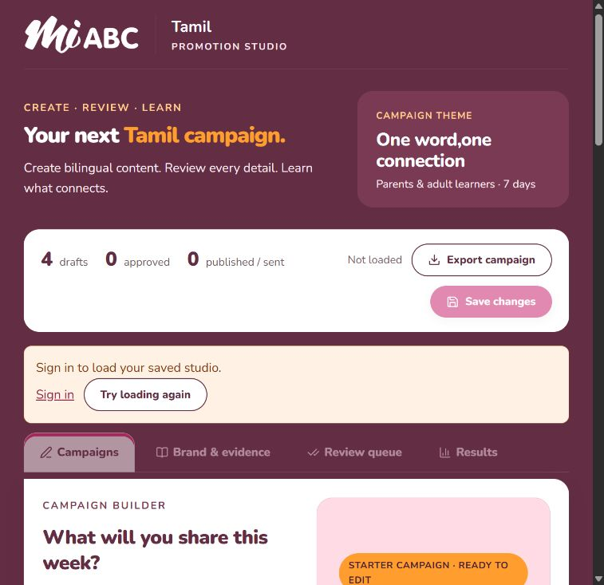
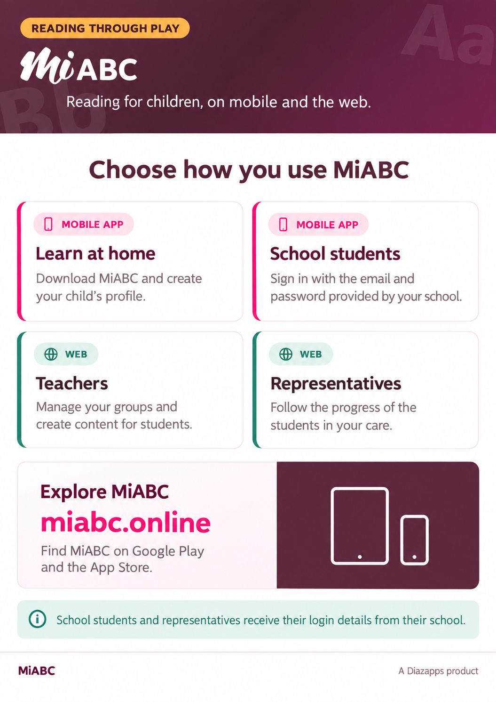
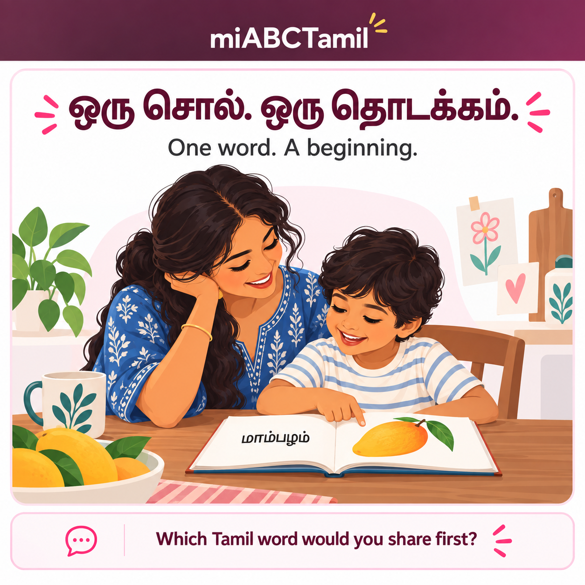
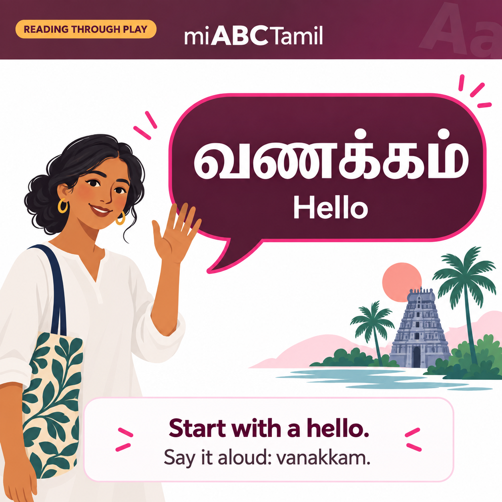
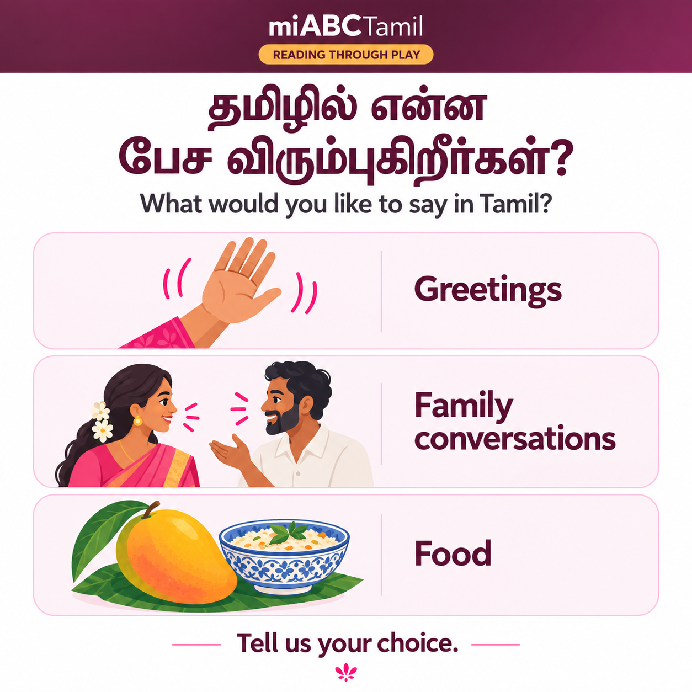
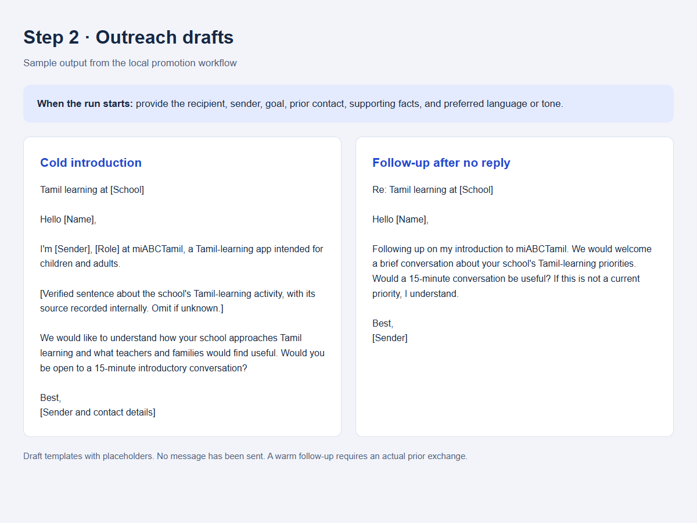
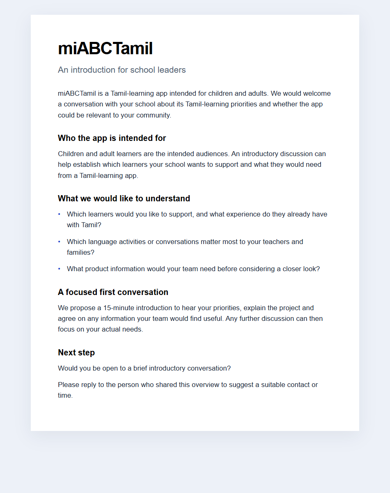
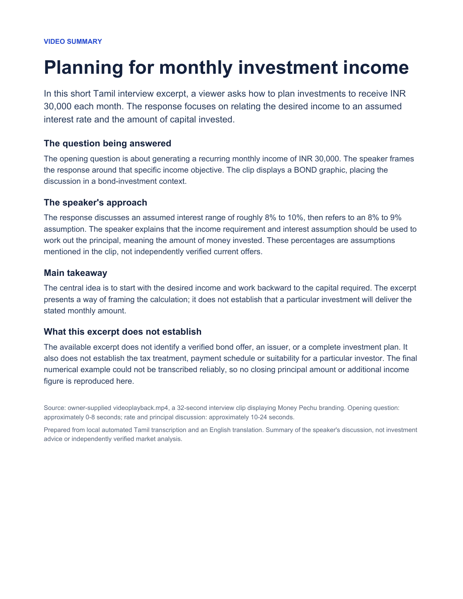
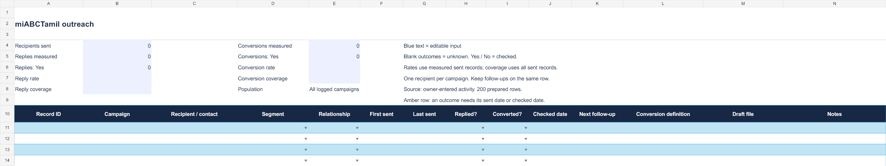
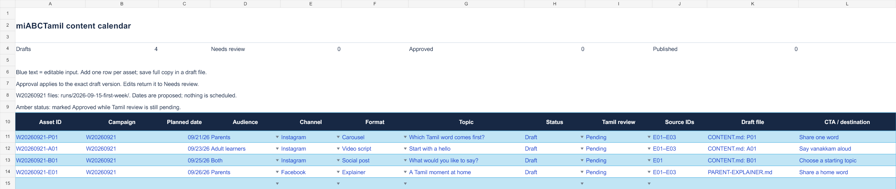

# miABCTamil Promotion Studio

Private Sites application for bilingual campaign drafting, evidence review, approval, outreach drafts and manual results tracking.

## Website design — September 18, 2026

The locally previewed website now follows [miabc.online](https://miabc.online): the MiABC logo, Nunito English typography with Nirmala UI for Tamil, deep plum backgrounds, pink buttons, orange highlights, and rounded white and pastel cards. The owner approved this visual direction.

This screenshot shows the local preview before sign-in. Saved campaign controls require authentication. It confirms the visual design, not a public deployment or a successful live AI generation test. The website palette uses plum `#632D43`, pink `#EB2178`, orange `#FF9D2E` and pastel pink `#FFDBE6`; the primary action uses the darker pink `#C41361`.

The flyer and bilingual post examples below describe promotional assets; their format-specific accents and typography may differ from the website.

## Updated content, flyer and demo style

Bilingual image posts, new flyers and demo materials follow the supplied **MiABC Tamil flyer and demo references**: burgundy headers, pink mobile accents, teal web accents, amber labels and rounded cards on white.

**English flyer sample · September 16, 2026.** This image demonstrates the shared visual direction for future flyers and demo sheets. It is a flattened draft awaiting owner review; its generated logo must be replaced with approved artwork for final production.

| Design element | Color | Use |
|---|---|---|
| Burgundy | `#4A1F30` / `#632D43` | Header and headings |
| Pink | `#EB2178` | Mobile app cards and accents |
| Teal | `#2E7D6B` | Web cards and accents |
| Amber | `#FFB64D` | Short header label |
| White / pale pink | `#FFFFFF` / `#F4E4EA` | Background and card borders |

Use **Nirmala UI for Tamil** and **Segoe UI for English**, with consistent spacing, role colors and footer treatment across matching assets.

[View the full-size flyer](promotion-workflow/runs/2026-09-16-brand-sample/MiABC-Flyer-English-Sample.png) · [Brand style guide](promotion-workflow/BRAND-STYLE.md) · [Color tokens](promotion-workflow/brand-tokens.json) · [Sample review notes](promotion-workflow/runs/2026-09-16-brand-sample/REVIEW.md)

## Visual walkthrough

These examples show the **local assistant workflow and its saved outputs**. They are separate from the website's interface. Start a run in chat, provide the requested details, review the generated files, and record confirmed results. Sample copy and images still need owner and Tamil-language review before publication.

### Step 1 — Create bilingual content and image posts

Give the assistant an audience, topic and goal. It creates Tamil/English captions, post images, explainers and video scripts, then records the drafts in the calendar.

**Example request:** “Create this week's campaign for Tamil diaspora parents and adult beginners.”

**Updated bilingual samples:** all three posts now use the shared burgundy, pink, teal and amber design direction. [Review notes and generation prompts](promotion-workflow/runs/2026-09-16-bilingual-style/REVIEW.md).

  
  
  

[Read the matching captions and video script](promotion-workflow/runs/2026-09-15-first-week/CONTENT.md). These three images are standalone posts; the greeting image is a static companion to the video script.

### Step 2 — Draft personalized outreach

Start an outreach run. The assistant asks for missing recipient and sender details, the goal, previous contact, supporting facts, and language/tone. After your answers, it drafts the appropriate email and short-message variants.

The screenshot shows templates with placeholders. Follow-ups after no reply and warm follow-ups after an actual conversation are handled separately. Nothing is sent automatically.

[Open the outreach workflow](promotion-workflow/runs/2026-09-15-outreach/START-HERE.md).

### Step 3 — Turn source material into shareable assets

Choose a one-pager, slide deck, module demo or testimonial asset. The assistant collects the relevant source files during the run, then creates the supported output for review.

**Current flyer example:** the English flyer above adapts the supplied Tamil flyer into the updated visual style. New demo sheets use the same palette and card treatment. [See the sample and source notes](promotion-workflow/runs/2026-09-16-brand-sample/REVIEW.md).

**Earlier school introduction sample:** a browser-viewable one-pager based on the supplied product description, created before the new style references were supplied. The Word draft was not delivered because its required renderer was unavailable.

**Video-to-summary test:** the supplied Tamil finance clip was transcribed locally and summarized into a one-page PDF. This is a third-party content-processing example, not miABCTamil market research or an endorsement. Unclear closing figures were omitted.

[Download the sample PDF](promotion-workflow/runs/2026-09-15-bond-video-summary/Bond-Video-One-Page-Summary.pdf) · [Read the asset-generator workflow](promotion-workflow/ASSET-GENERATOR.md).

### Step 4 — Track sends, replies and conversions

Tell the assistant what happened, or update the Excel workbook directly. It records confirmed events and reviews outcomes using the conversion goal you define.

**Example update:** “This contact replied asking for a demo.” A reply is recorded without assuming a demo has been booked.

The outreach tracker starts empty. Rates remain blank until outcomes are measured; no sample sends or conversions have been invented.

[Open the Excel workbook](promotion-workflow/miABCTamil-Tracker.xlsx) · [Read the tracking guide](promotion-workflow/TRACKING.md).

The current example has **four content drafts and no logged outreach activity**. Tracking updates come from your reports or workbook edits; there is no automatic inbox synchronization.

## Runtime

- React/Vinext on Cloudflare Workers.
- D1 `DB` persists each signed-in user's workspace. Optimistic revisions prevent stale-tab overwrites.
- Private Sites access protects the app. API routes also require the platform-provided signed-in identity and check mutation origins.
- Claude Messages API generation uses the owner’s server-side ANTHROPIC_API_KEY secret. Viewers never enter or receive the key.
- The owner must configure the server secret before live generation is available. Starter drafts and editing work without it.
- No external publishing or email sending is implemented. Publication records document actions the user performs elsewhere.

## Workflow

Add real app facts and source permissions in Brand & evidence. Generate or edit a draft, save it, then complete evidence and Tamil review in Review queue. Approve the exact version. Record actual publication URL/date, then enter metrics with reporting windows and sources. Editing draft content resets approval and increments its version; published copy is locked and can be duplicated.

## Development

Install with the locked `install:ci` script. Start `npm run dev`. Generate migrations with `npm run db:generate` after schema changes. Use the Sites build and packaging workflow for publication. Portable previews provide a loopback-only mock sign-in route; it is excluded from production.

## Validation performed

TypeScript and production build passed. Local API tests verified authentication, persistence, stale writes, approval gates, version changes, published-content locking and numeric zero preservation. Browser checks verified save feedback, disabled approval, mobile navigation, and WebMCP draft read/open behavior including invalid IDs.

Live Claude generation has not been tested with a paid key. The app handles missing keys, rejected keys, rate limits, unavailable models, timeouts and malformed model output. Tamil starter content still requires fluent review.

## Owner-only AI setup

For local development, fill ANTHROPIC_API_KEY in the ignored .env file and restart the server. Do not prefix secrets with VITE_ or NEXT_PUBLIC_. ANTHROPIC_MODEL is optional. For hosting, configure ANTHROPIC_API_KEY as a secret in the hosting environment, then deploy. No viewer-facing key form exists. Never commit the actual .env file.

## Local promotion workflow

Open [promotion-workflow/START-HERE.md](promotion-workflow/START-HERE.md) for the on-request assistant workflow:

- Bilingual content and generated image posts.
- Outreach drafts with recipient intake when an outreach run starts.
- Asset-generation instructions, examples, and video-summary output.
- [Excel tracker](promotion-workflow/miABCTamil-Tracker.xlsx) for confirmed sends, replies and conversions.

Ask your assistant to read [the workflow skill](promotion-workflow/miabctamil-promotion/SKILL.md), then give it a task. Generated files are stored in `promotion-workflow/runs/`. This workflow is separate from the website; it does not send emails, publish posts, or execute weekly without a request. The source machine's transcription dependencies and downloaded models are local workspace tools and are not included in this repository.
